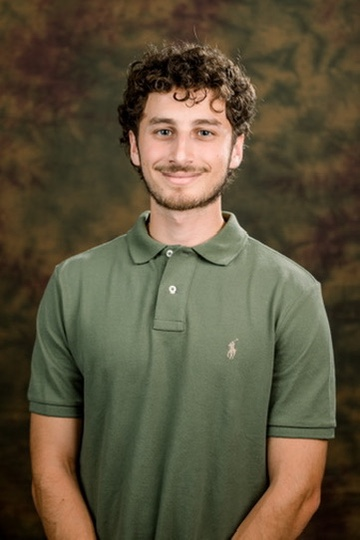

# Who am I?


Hi! I am Ori Chason, a Junior standing undergrad at UCSD, majoring in Computer Science. Outside of school I like to
- be outdoors
- run
- play sports
- photography
- cooking
  
On the programming side, I enjoy programming MCUs and learning about how they work. I'm either messing with basic arduino stuff or more advanced STM32 projects.

## Where is AI heading?
So the biggest **uncertainty** for us all, especially in the CS field is AI and where it's heading. I've been dedicating a significant amount of my time getting involved with AI tools because the more I use the more I will understand how it's strong and how it's weak.

I found an article titled [When AI writes almost all code, what happens to software engineering?](https://newsletter.pragmaticengineer.com/p/when-ai-writes-almost-all-code-what). It's amazing to see how software engineers react to AI and how it is affecting their day to day job and how they look at developing code in 2026. A quote from the article that I can relate to was written by a software engineer saying,  
> What I learned over the course of the year is that typing out code by hand now frustrates me. 

The same reason I use my phone to text a friend instead of sending him a letter in the mail, is the same reason I use AI now to write my code instead of by hand. And how do I stop that, and should I stop that? That's the biggest question for me as a student.

Coming from a CTO,
> I don’t want to be too dramatic, but y’all have to throw away your priors. The cost of software production is trending towards zero.

This line should make programmers reconsider their jobs. And that is why the focus should immediate exit being a programmer, and should shift towards being an engineer.

Up until today we learned basic syntax like 

```
if
for
while
do while
int
```

etc, and we're at a point in time where I don't think future generations are going to need to learn that anymore. But I feel like the same way we weren't taught how to write in machine code, something that engineers needed to do back in the day.


Wait... did you forget to read about me? Click here! [About Me](#who-am-i)

Remember how I said I love to cook... here is a cool picture of some steaks I made this summer! [Click Here](bincho.jpg)

Click here to see a picture I took of UCSD's Jacobs School of Engineering! [Click Here](jacobs.jpg)

## TL;DR

This is what you read...
- [ ] the about me
- [ ] ai rant
- [x] the TL;DR !